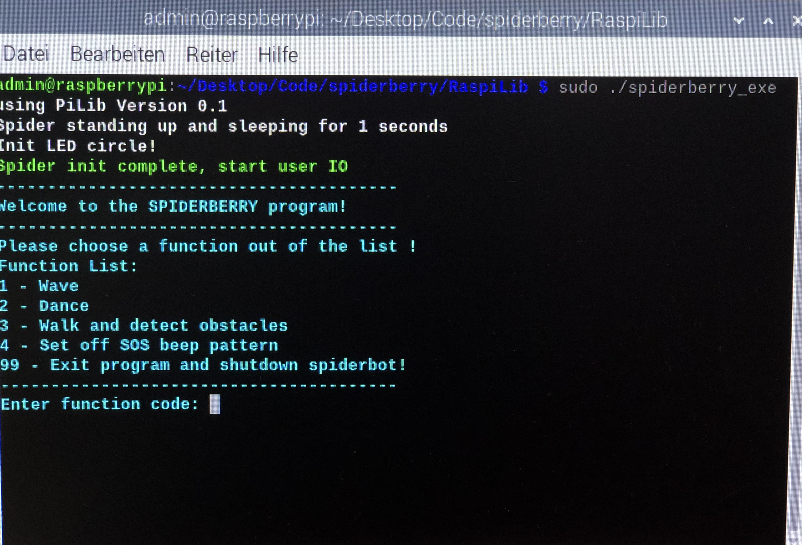
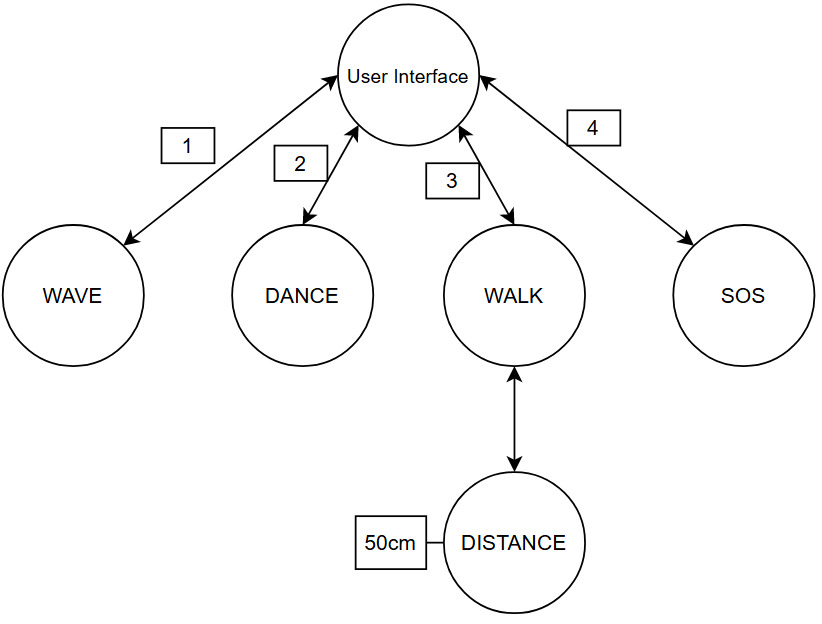

# Spiderberry architecture

This document describes the architecture and implementation considerations of Spiderberry. If this document is outside of GitHub, [here](https://github.com/MichaelKirchhofer/spiderberry) you can find the source code.

## Scope
---

>### Requirements

The following requirements are currently known and considered in the implementation.

- The spider shall dance and beep at the same time.
- The spider shall recognize objects and avoid them.
- At the Startup, the spider shall start waving.
- The spider should lie down and beep 3 times SOS Morsecode when the batteries are empty.
- The LEDs at the back should point the direction of movement.

>### Infrastructure

The Spiderberry is written in C++. But it contains libraries like `rpi_ws281x` written in C. Building and compilation process is made by CMake.

## User Model
---
>### User Roles
Both skilled as well as inexperienced user can interact with spiderberry with no difficulties. On the platform there are 2 buttons:
1. **CTRL:** which activates the Raspberry Pi
2. **LOAD:** which activates the the rest of the spider

After that the Spiderberry can move around on it's own without any human intervention needed.
The spider is not meant for industrial applications but rather for research purposes.

Besides that, there is an User Interface as shown above.

>### Domain Use Cases

#### UC1 - Startup
---
After powering up the spider, all 6 legs 
are performed so that the spider can stand up.

__Precondition:__ All legs should be straight.

__Scenario 1:__ All legs are straight and the spider can stand up.

__Scenario 2:__ All legs or some legs are in such a position that the spider cannot stand up.

#### UC2 - Waving
---
The right front leg can be controlled to make a wave pattern.

__Precondition:__ The spider can be in a stand-up position or laying down.

__Scenario 1:__ The spider is waving his right front leg.

#### UC3 - Moving
---
By controlling all 6 legs after the Startup, the spider can walk.

__Precondition:__ The Startup must have been performed and the ultrasonic sensor must be active.

__Scenario 1:__ Ultrasonic sensor is active and the spider can move safely.

__Scenario 2:__ Ultrasonic sensor is not active and the spider is running eternally.

#### UC4 - Dancing
---
The spider is able to dance the waltz while simultaneously beep to the three/fourths rythm.

__Precondition:__ The Startup must have been performed.

__Scenario 1:__ The spider is dancing.

## Domain Model
---
This chapter describes the role of the Spiderberry in the context of the Spider.

>### Information Flow

## Architecture Model
---
This chapter describes the architecture model of the Spiderberry.

>### External Dependencies

External library to control LED Circle.
Some libraries use system calls on Linux.

>### Threading Model

The software makes use of multithreading to perform beeping and dancing at the same time.

>### Static Architecture

This chapter describes the components of the static architecture of the Spiderberry.

#### **Raspberry Pi Model 3 B+**

The Raspberry Pi is the main component. It is responsible for initializing all the other components, and it provides the controlling of the other components. This is the main entry point of the application.

#### **Servomotors**

The servomotors are responsible for the movement of the spider. The Spiderberry has 6 legs that are controlled by Raspberry Pi. Depending on the parameters in the software, he can move along the x- axis and y-axis.

#### **Ultrasound Sensor**

The ultrasound sensor is used to determine the distance of an obstacle. Based on the distance it can controll further components.

#### **Buzzer**

Buzzer is used for signaling. For example when the battery is about to get empty, when dancing or detecting obstacles.

#### **LED Circle**

LED Circle consists of 7 RGB LEDs that are placed in a circle. They are used to indicate the direction of the movemment of the spider.

#### **Power System**

In sum there are more than 20 servomotors that need a lot of power. One casual power supply is not enough. There 6 batteries can be installed on the bottom of the spider for maximal experience.

## Testability
---
Code is partially tested with Catch2 Framework.

